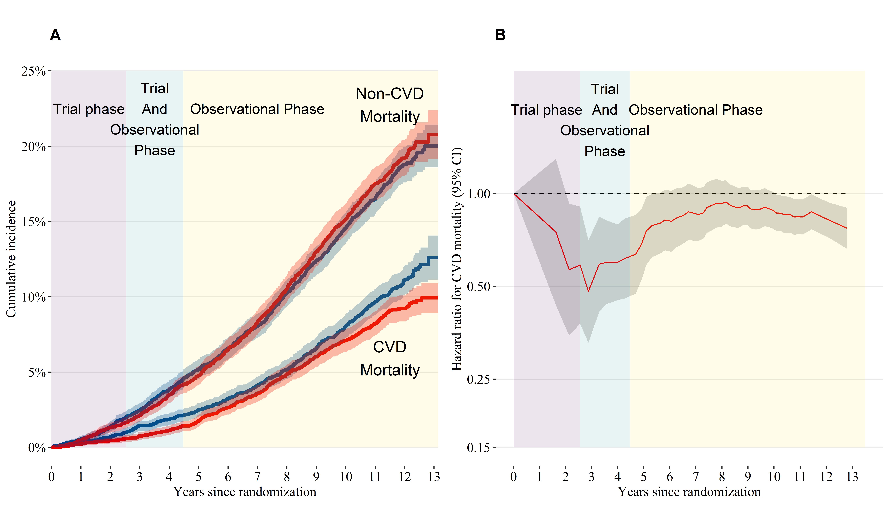

<!-- README.md is generated from README.Rmd. Please edit that file -->

# sprint-mortality-ndi

<!-- badges: start -->
<!-- badges: end -->
# ABSTRACT

**IMPORTANCE**. The Systolic Blood Pressure Intervention Trial (SPRINT)
showed that intensive treatment, defined by a systolic blood pressure
(SBP) goal of \<120 mmHg, reduced the risk of cardiovascular morbidity
and mortality. However, the post-trial association of intensive
treatment with mortality is unknown.

**OBJECTIVE**. To evaluate the association of receiving intensive
treatment for approximately three years during the SPRINT trial with
all-cause and cardiovascular mortality up to ten years
post-randomization.

**DESIGN, SETTING, AND PARTICIPANTS**. SPRINT, a randomized clinical
trial of 9361 patients aged 50 years or older with hypertension and
increased cardiovascular risk, but without diabetes or history of
stroke. Randomization began on November 8, 2010, the trial intervention
ended on August 20, 2015, and trial follow-up visits occurred through
July 2016.

**INTERVENTIONS**. Randomization to SBP goal of either \<120 mmHg
(intensive treatment, N=4678) versus \<140 mmHg (standard treatment,
N=4683).

**MAIN OUTCOMES AND MEASURES**. All-cause and cardiovascular mortality
assessed via the US National Death Index, beginning in 2016 through
December 31st, 2020. In a subset of 3644 trial participants, outpatient
SBP levels measured in routine clinical practice after the trial were
examined.

**RESULTS**. Among 9361 randomized participants (mean \[standard
deviation\] age 67.9 (9.4) years; 35.6% women), the median intervention
phase was 3.3 years. Over a median follow-up of 8.76 years, intensive
treatment was beneficial for both cardiovascular (Hazard Ratio \[HR\] =
0.66, 95% confidence interval \[CI\] 0.49 to 0.89) and all-cause
mortality (HR = 0.83, 95% CI 0.68 to 1.01) through close-out visits for
the trial. However, there was no evidence of association during
post-trial follow-up for cardiovascular (HR = 1.02, 95% CI 0.84 to 1.24)
or all-cause mortality (HR = 1.08, 95% CI 0.94 to 1.23). The estimated
mean (95% CI) SBP among participants randomized to intensive treatment
was 133 (132, 134) at 5 years and 140 (138, 143) at 10 years
post-randomization.

**CONCLUSIONS AND RELEVANCE**. The beneficial effect of intensive
treatment on cardiovascular and all-cause mortality was attenuated
during post-trial observational follow-up. Given increasing SBP levels
in participants randomized to intensive treatment following the trial,
these results highlight the importance of consistent long-term
management of hypertension.

**CENTRAL ILLUSTRATION**

Panel A: Cumulative incidence of cardiovascular and non-cardiovascular
mortality by treatment group. Panel B: Time-dependent effect of
randomization to intensive treatment for cardiovascular mortality.

<!-- -->
